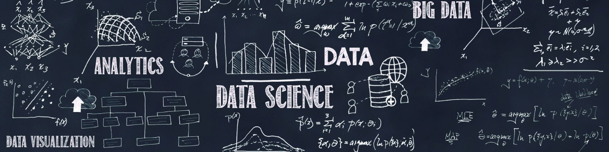

# Oii 😉 

Quero te dar as boas-vindas à minha página no GitHub! :octocat:

Aqui eu publico alguns projetos na área de Data Science.
Fique à vontade para explorar as soluções! E, qualquer crítica construtiva, pode me enviar! Sempre muito bom observar o mesmo problema sobre a ótica de outra pessoa!!!

## Projetos em Destaque:
**1. [Churn Prediction](https://github.com/renanwilliams/ChurnPrediction)**

A manager at the bank is disturbed with more and more customers leaving their credit card services. They would really appreciate if one could predict for them who is gonna get churned so they can proactively go to the customer to provide them better services and turn customers' decisions in the opposite direction. 

**2. [TimeSeries - PredictingPopulationNYCMetro](https://github.com/renanwilliams/TimeSeries-PredictingPopulationNYCMetro)**

O objetivo principal é prever o número de pessoas que usam o metrô.

**3. [WordCloud](https://github.com/renanwilliams/WordCloud)**

Dois métodos de WordCloud utilizando tweets dos antigos candidatos (Lula e Bolsonaro) à presidência do Brasil no período eleitoral de 2022.
